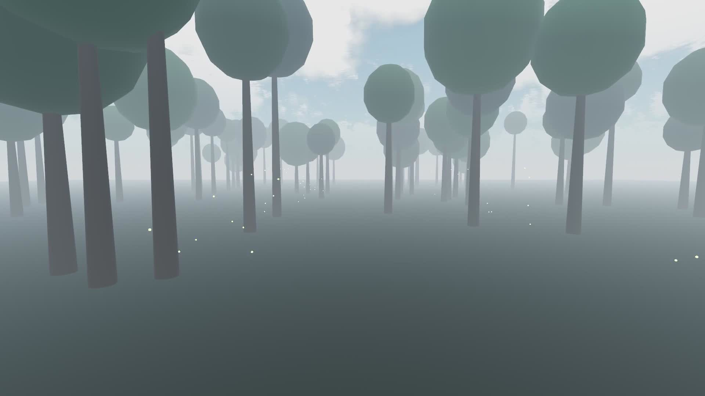

# Hollywood

An audio, video and broadcasting agent built by Justin Fowler. Hollywood combines
a local planning model with durable production jobs, procedural scene rendering,
audio-reactive visuals and bounded private live previews.

[Watch the forest preview](assets/forest-preview.mp4) · [Project page](https://justinfowler.com/portfolio.html#open-hollywood)

The four-second silent preview is a rendered excerpt: moving foliage and fireflies
in a stylized forest. It is a procedural prototype, not photorealistic footage.

## What is implemented

- Seven procedural scene presets and shared camera, palette and motion controls.
- Actual audio energy/frequency response and ordered crossfaded scene programs.
- Persistent jobs, saved outputs and a fifteen-tool MCP interface.
- Private HLS generation ahead of playback, bounded retained chunks, filler and restart recovery.
- Existing prepared-program broadcasting with explicit destinations.

On the development Mac Studio, a short 1080p music-reactive test produced 16 seconds
of video in 9.165 seconds. A twelve-chunk 720p stress test exercised restart, forced
GPU starvation, filler and recovery. These are bounded measurements, not guaranteed
performance or long-running streaming qualification.

## Release scope and setup

This is a source-available export, not a turnkey installer or a claim that every
Hollywood roadmap item is complete. Private deployment configuration, model archive
inventory, credentials, media library and development history are excluded.
The operational development system has 31 passing automated tests; this public
export has separate import/compile smoke checks and is not independently qualified
as a full production installation.

Use macOS with a logged-in graphical session for Godot Metal rendering. Install
FFmpeg, Godot and optional Blender separately. The generic base directory is
/opt/hollywood; model runtimes and optional image services must be configured
locally. STUDIO_MEDIA_STATE and STUDIO_MEDIA_PYTHON override state and worker Python.
The runtime-lock files record development dependencies; they do not install model
weights. Run `python department.py capabilities` to inspect the operation catalogue.
Run `python department.py serve` for MCP, and `python service.py` for the private UI.
Missing optional engines/models mean their operations are unavailable.

Cursor and Claude Code/Desktop can connect to this stdio MCP server. Use the same
project ID to share jobs/assets; host conversations do not automatically synchronize.
See [the Hollywood agent instructions](SKILL.md).

## Still being built

Richer scenery, continuous audio through filler, a rolling external RTMP bridge,
and broader device/long-duration qualification. 4K is an offline export option;
real-time 4K is not qualified.

## Authorship

Original Hollywood application code is by Justin Fowler. The system uses public
open-source engines and includes a licensed Godot sky-demo adaptation. See
[public third-party notices](THIRD_PARTY_NOTICES.md). Original code is source-available
under the accompanying notice, not offered under an open-source license.
